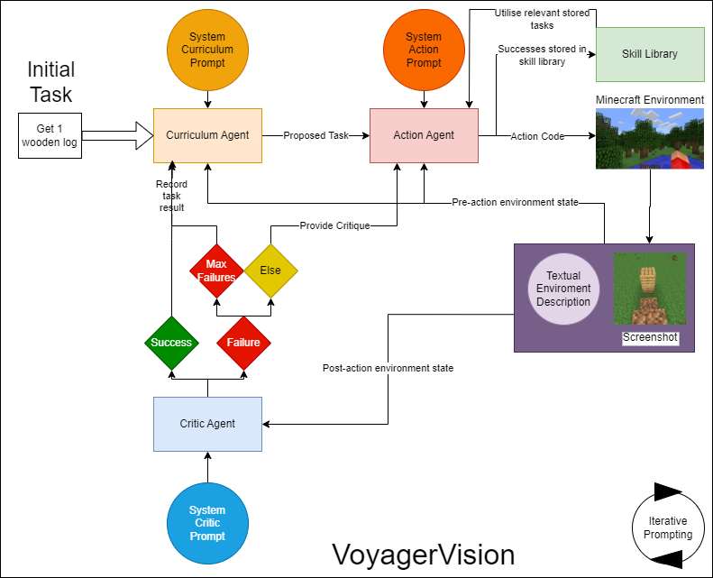

# VoyagerVision: Investigating the Role of Multi-modal Information for Open-ended Learning Systems
<div align="center">

[[Website]](https://voyager.minedojo.org/)
[[Arxiv]](https://arxiv.org/abs/2305.16291)
[[PDF]](https://voyager.minedojo.org/assets/documents/voyager.pdf)
ALL TODO

[](https://github.com/MineDojo/Voyager)
[](https://github.com/MineDojo/Voyager/blob/main/LICENSE)
______________________________________________________________________




</div>

Open-endedness is an active field of research in the pursuit
of capable Artificial General Intelligence (AGI), allowing models to pur-
sue tasks of their own choosing. Simultaneously, recent advancements in
Large Language Models (LLMs) such as GPT-4o [9] have allowed such
models to be capable of interpreting image inputs. Implementations such
as OMNI-EPIC [4] have made use of such features, providing an LLM
with pixel data of an agent’s POV to parse the environment and allow
it to solve tasks. This paper proposes that providing these visual in-
puts to a model gives it greater ability to interpret spatial environments,
and as such, can increase the number of tasks it can successfully perform,
extending its open-ended potential. To this aim, this paper proposes Voy-
agerVision - a multi-modal model capable of creating structures within
Minecraft using screenshots as a form of visual feedback, building on the
foundation of Voyager. VoyagerVision was capable of creating an average
of 2.75 unique structures within fifty iterations of the system, as Voy-
ager was incapable of this, it is an extension in an entirely new direction.
Additionally, in a set of building unit tests VoyagerVision was successful
in half of all attempts in flat worlds, with most failures arising in more
complex structures.

In this repo, we provide VoyagerVision code. This codebase is under [MIT License](LICENSE).

# Installation
VoyagerVision requires Python ≥ 3.9 and Node.js ≥ 16.13.0. We have tested on Ubuntu 20.04, Windows 11, and macOS. You need to follow the instructions below to install VoyagerVision.

## Python Install
```
git clone https://github.com/ESmyth-dev/VoyagerVision
cd Voyager
pip install -e .
```

## Node.js Install
In addition to the Python dependencies, you need to install the following Node.js packages:
```
cd voyager/env/mineflayer
npm install -g npx
npm install
cd mineflayer-collectblock
npx tsc
cd ..
npm install
```

## Minecraft Instance Install

VoyagerVision depends on Minecraft game. You need to install Minecraft game and set up a Minecraft instance.

Follow the instructions in [Minecraft Login Tutorial](installation/minecraft_instance_install.md) to set up your Minecraft Instance.

## Fabric Mods Install

You need to install fabric mods to support all the features in VoyagerVision. Remember to use the correct Fabric version of all the mods. 

Follow the instructions in [Fabric Mods Install](installation/fabric_mods_install.md) to install the mods.

# Getting Started
VoyagerVision uses OpenAI's GPT-4o as the language model. You need to have an OpenAI API key to use VoyagerVision. You can get one from [here](https://platform.openai.com/account/api-keys).

After the installation process, you can run VoyagerVision by:
```python
from voyager import Voyager

# You can also use mc_port instead of azure_login, but azure_login is highly recommended
azure_login = {
    "client_id": "YOUR_CLIENT_ID",
    "redirect_url": "https://127.0.0.1/auth-response",
    "secret_value": "[OPTIONAL] YOUR_SECRET_VALUE",
    "version": "fabric-loader-0.14.18-1.19", # the version Voyager is tested on
}
openai_api_key = "YOUR_API_KEY"

voyager = Voyager(
    azure_login=azure_login,
    openai_api_key=openai_api_key,
)

# start lifelong learning
voyager.learn()
```

* If you are running with `Azure Login` for the first time, it will ask you to follow the command line instruction to generate a config file.
* For `Azure Login`, you also need to select the world and open the world to LAN by yourself. After you run `voyager.learn()` the game will pop up soon, you need to:
  1. Select `Singleplayer` and press `Create New World`.
  2. Set Game Mode to `Creative` and Difficulty to `Peaceful`.
  3. After the world is created, press `Esc` key and press `Open to LAN`.
  4. Select `Allow cheats: ON` and press `Start LAN World`. You will see the bot join the world soon. 

# Resume from a checkpoint during learning

If you stop the learning process and want to resume from a checkpoint later, you can instantiate VoyagerVision by:
```python
from voyager import Voyager

voyager = Voyager(
    azure_login=azure_login,
    openai_api_key=openai_api_key,
    ckpt_dir="YOUR_CKPT_DIR",
    resume=True,
)
```

# Run VoyagerVision for a specific task with a learned skill library

If you want to run VoyagerVision for a specific task with a learned skill library, you should first pass the skill library directory to VoyagerVision:
```python
from voyager import Voyager

# First instantiate Voyager with skill_library_dir.
voyager = Voyager(
    azure_login=azure_login,
    openai_api_key=openai_api_key,
    skill_library_dir="./skill_library/trial1", # Load a learned skill library.
    ckpt_dir="YOUR_CKPT_DIR", # Feel free to use a new dir. Do not use the same dir as skill library because new events will still be recorded to ckpt_dir. 
    resume=False, # Do not resume from a skill library because this is not learning.
)
```
Then, you can run task decomposition. Notice: Occasionally, the task decomposition may not be logical. If you notice the printed sub-goals are flawed, you can rerun the decomposition.
```python
# Run task decomposition
task = "YOUR TASK" # e.g. "Craft a diamond pickaxe"
sub_goals = voyager.decompose_task(task=task)
```
Finally, you can run the sub-goals with the learned skill library:
```python
voyager.inference(sub_goals=sub_goals)
```

For all valid skill libraries, see [Learned Skill Libraries](skill_library/README.md).

# FAQ
If you have any questions, please check our [FAQ](FAQ.md) first before opening an issue.

# Paper and Citation

If you find our work useful, please consider citing us! 

```bibtex
@article{wang2023voyager,
  title   = {Voyager: An Open-Ended Embodied Agent with Large Language Models},
  author  = {Guanzhi Wang and Yuqi Xie and Yunfan Jiang and Ajay Mandlekar and Chaowei Xiao and Yuke Zhu and Linxi Fan and Anima Anandkumar},
  year    = {2023},
  journal = {arXiv preprint arXiv: Arxiv-2305.16291}
}
```
TODO

Disclaimer: This project is strictly for research purposes.
